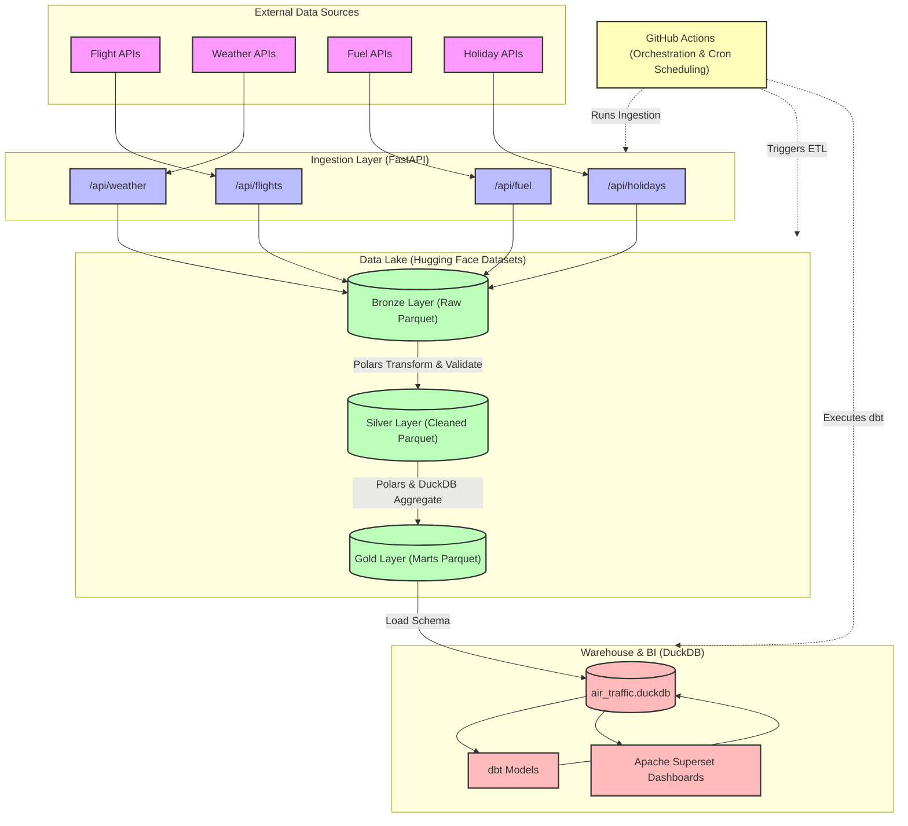
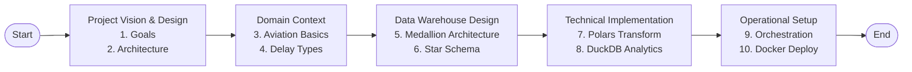

---
tags:
  - moc
  - index
  - air-traffic-warehouse
  - data-engineering
status: complete
last_updated: 2026-07-11
---

# ✈️ Air Traffic Warehouse - Map of Content (MOC)

Welcome to the **Air Traffic Warehouse** documentation index. This central file is designed to help you navigate the entire repository documentation vault. Whether you are viewing this in [Obsidian](https://obsidian.md/), VS Code, or GitHub, all links are relative and fully clickable.

---

## 🏛️ System Architecture Overview

Below is the high-level data flow and system architecture for the Air Traffic Platform. It follows the **Medallion Architecture** pattern using zero-cost, open-source modern data stack technologies.

---

## 🗺️ Documentation Map

Click on any of the sections below to navigate to the specific documentation files.

### 🌟 00 - Project Vision & Design
*Foundational goals, requirements, and system design.*
* **[Architecture](00%20-%20Project%20Vision/Architecture.md)**: High-level architectural diagrams, component layouts, and network topologies.
* **[Goals](00%20-%20Project%20Vision/Goals.md)**: Primary objectives, business/technical success criteria, and non-goals of the project.
* **[Requirements](00%20-%20Project%20Vision/Requirements.md)**: Functional constraints, SLA requirements, and system properties.

### ✈️ 01 - Domain Knowledge
*Crucial business domain context for air traffic control, airports, and airline metrics.*
* **[Airlines](01%20-%20Domain%20Knowledge/Airlines.md)**: Key airline indicators, fleet sizing, passenger capacities, and industry codes.
* **[Airports](01%20-%20Domain%20Knowledge/Airports.md)**: Hub structures, gate operations, runway logistics, and airport coordinates.
* **[Aviation Basics](01%20-%20Domain%20Knowledge/Aviation%20Basics.md)**: Airspace structure, flight scheduling (scheduled vs. actual), and status codes.
* **[Delay Types](01%20-%20Domain%20Knowledge/Delay%20Types.md)**: Detailed breakdown of delay categories (Carrier, Weather, NAS, Security, Late Aircraft).
* **[Weather](01%20-%20Domain%20Knowledge/Weather.md)**: Flight rules (VFR vs. IFR), meteorological phenomena, and weather station alignments.

### 🏗️ 02 - Data Engineering Concepts
*Core dimensional modeling and architectural paradigms used in the platform.*
* **[Data Lake](02%20-%20Data%20Engineering%20Concepts/Data%20Lake.md)**: Raw storage patterns, directory layout schemas, and Hugging Face Dataset advantages.
* **[Data Warehouse](02%20-%20Data%20Engineering%20Concepts/Data%20Warehouse.md)**: OLAP design principles, analytical queries, and structured indexing.
* **[Dimension Tables](02%20-%20Data%20Engineering%20Concepts/Dimension%20Tables.md)**: Design and attributes of `dim_airport`, `dim_airline`, `dim_weather`, and `dim_date`.
* **[ETL vs ELT](02%20-%20Data%20Engineering%20Concepts/ETL%20vs%20ELT.md)**: Trade-off analysis between ETL (Polars in-memory) and ELT (DuckDB SQL-on-files).
* **[Fact Tables](02%20-%20Data%20Engineering%20Concepts/Fact%20Tables.md)**: Transaction grain metrics for `fact_flights` and `fact_delays`.
* **[Medallion Architecture](02%20-%20Data%20Engineering%20Concepts/Medallion%20Architecture.md)**: In-depth view of the Bronze (Raw) $	o$ Silver (Cleaned) $	o$ Gold (Marts) flow.
* **[OLTP vs OLAP](02%20-%20Data%20Engineering%20Concepts/OLTP%20vs%20OLAP.md)**: Comparison of transactional workloads vs. analytical workloads.
* **[Partitioning](02%20-%20Data%20Engineering%20Concepts/Partitioning.md)**: Folder structures, partition pruning, and execution optimization.
* **[Slowly Changing Dimensions (SCD)](02%20-%20Data%20Engineering%20Concepts/Slowly%20Changing%20Dimensions.md)**: Management of changing properties over time (SCD Type 1 vs. Type 2).
* **[Star Schema](02%20-%20Data%20Engineering%20Concepts/Star%20Schema.md)**: Relational model connecting Fact tables to Dimension tables.

### 💾 03 - Storage & File Formats
*How data is stored, compressed, and versioned.*
* **[Compression](03%20-%20Storage/Compression.md)**: Comparative analysis of Snappy vs. Gzip vs. Zstd in columnar files.
* **[Dataset Versioning](03%20-%20Storage/Dataset%20Versioning.md)**: How Git commit history is used on Hugging Face to track versioned releases of data.
* **[Hugging Face Dataset](03%20-%20Storage/Hugging%20Face%20Dataset.md)**: Integrating Hugging Face as a serverless, free-tier data lake storage engine.
* **[Parquet](03%20-%20Storage/Parquet.md)**: Apache Parquet columnar properties, metadata, and schemas.

### 🔄 04 - ETL Pipelines
*The extract, transform, and load mechanisms.*
* **[Data Validation](04%20-%20ETL/Data%20Validation.md)**: Data quality rules, constraints, and validation thresholds.
* **[Error Handling](04%20-%20ETL/Error%20Handling.md)**: Pipeline failure recovery, notifications, and logging.
* **[Extraction](04%20-%20ETL/Extraction.md)**: API collector scripts, rates, and pagination strategies.
* **[Incremental Loading](04%20-%20ETL/Incremental%20Loading.md)**: Watermarking techniques using `last_run.json` to process only net-new events.
* **[Loading](04%20-%20ETL/Loading.md)**: Load strategies (appending facts vs. upserting dimensions).
* **[Transformation](04%20-%20ETL/Transformation.md)**: Data cleaning, UTC timestamp normalization, and schema casting.

### 📊 05 - SQL Analytics
*Standard analytical SQL expressions used to query our warehouse.*
* **[Aggregation](05%20-%20SQL/Aggregation.md)**: Fast summary metrics, `SUM`, `AVG`, and multi-column groupings.
* **[CTE (Common Table Expressions)](05%20-%20SQL/CTE.md)**: Improving query modularity, readability, and compilation.
* **[Joins](05%20-%20SQL/Joins.md)**: Joining Star Schemas using left joins on surrogate keys.
* **[Optimization](05%20-%20SQL/Optimization.md)**: SQL tips (selecting specific columns, filtering early, utilizing indexes).
* **[Ranking](05%20-%20SQL/Ranking.md)**: Assigning order index using `RANK`, `DENSE_RANK`, and `ROW_NUMBER`.
* **[Window Functions](05%20-%20SQL/Window%20Functions.md)**: Running calculations across partitions (`AVG OVER`, `LAG`, `LEAD`).

### 🦆 06 - DuckDB Warehouse
*Leveraging DuckDB as our embedded SQL OLAP Engine.*
* **[Basics](06%20-%20DuckDB/Basics.md)**: Introduction to DuckDB, the "SQLite for Analytics".
* **[Performance](06%20-%20DuckDB/Performance.md)**: Columnar/vectorized query execution, filter pushdowns, and parallel query scanning.
* **[Querying Parquet](06%20-%20DuckDB/Querying%20Parquet.md)**: Running SQL directly over Parquet files on disk or remote URLs.
* **[Warehouse Design](06%20-%20DuckDB/Warehouse%20Design.md)**: Structuring `air_traffic.duckdb` and linking it to BI tools.

### 🐻 07 - Polars Transformation
*In-memory processing at scale using Polars.*
* **[Aggregation](07%20-%20Polars/Aggregation.md)**: High-speed grouping and multi-column aggregation.
* **[DataFrames](07%20-%20Polars/DataFrames.md)**: Arrow memory layout, comparison with Pandas, and core types.
* **[GroupBy](07%20-%20Polars/GroupBy.md)**: Fast parallel GroupBy operations.
* **[Lazy API](07%20-%20Polars/Lazy%20API.md)**: Query optimization, scan operations, and predicate pushdowns.
* **[Optimization](07%20-%20Polars/Optimization.md)**: Polars-specific optimizations, avoiding python UDFs, streaming execution.

### ⏰ 08 - Orchestration
*Running pipelines on schedule.*
* **[Cron](08%20-%20Orchestration/Cron.md)**: Standard cron formats and schedule trigger settings.
* **[GitHub Actions](08%20-%20Orchestration/GitHub%20Actions.md)**: Serverless, zero-cost scheduling workflow (`etl.yml`).
* **[Scheduling](08%20-%20Orchestration/Scheduling.md)**: Task dependencies, sequential execution, and alerts.

### 📈 09 - Analytics & BI
*Deriving business value from the warehouse.*
* **[Business Questions](09%20-%20Analytics/Business%20Questions.md)**: Key operational questions answered by our data models.
* **[Dashboards](09%20-%20Analytics/Dashboards.md)**: Visualizing the Gold Layer with Apache Superset dashboards.
* **[KPIs](09%20-%20Analytics/KPIs.md)**: On-Time Performance (OTP), Cancellation Rates, Average Delays.

### 🐳 10 - Deployment & CI/CD
*Production deployment and testing configurations.*
* **[CI-CD](10%20-%20Deployment/CI-CD.md)**: Formatting, linting (`ruff`), and testing (`pytest`) pipelines.
* **[Docker](10%20-%20Deployment/Docker.md)**: Multi-container setup for FastAPI, Superset, and DBT.
* **[Vercel](10%20-%20Deployment/Vercel.md)**: Serverless hosting for FastAPI ingestion service.

### 📝 11 - Architectural Decision Records (ADRs)
*Documentation of critical architectural choices and their rationale.*
* **[Why DuckDB](11%20-%20ADR/Why%20DuckDB.md)**: Decision matrix leading to DuckDB.
* **[Why GitHub Actions](11%20-%20ADR/Why%20GitHub%20Actions.md)**: Choosing GitHub Actions over Airflow/Dagster.
* **[Why Hugging Face](11%20-%20ADR/Why%20Hugging%20Face.md)**: Opting for Hugging Face Hub as our free storage layer.
* **[Why Polars](11%20-%20ADR/Why%20Polars.md)**: Benchmarking Polars against Pandas and Spark.

---

## 🧭 Suggested Learning Path

If you are new to the codebase, we recommend reading the files in the following order:

1. **Start with the high-level design:**
   - Read **[Goals](00%20-%20Project%20Vision/Goals.md)** to understand what we are building.
   - Read **[Architecture](00%20-%20Project%20Vision/Architecture.md)** to see the structural flow.
2. **Gain business domain context:**
   - Read **[Aviation Basics](01%20-%20Domain%20Knowledge/Aviation%20Basics.md)** and **[Delay Types](01%20-%20Domain%20Knowledge/Delay%20Types.md)**.
3. **Understand the analytical modeling theory:**
   - Review **[Medallion Architecture](02%20-%20Data%20Engineering%20Concepts/Medallion%20Architecture.md)** and **[Star Schema](02%20-%20Data%20Engineering%20Concepts/Star%20Schema.md)**.
4. **See the code-level implementation details:**
   - Learn how we extract and clean data: **[Transformation](04%20-%20ETL/Transformation.md)** and **[Lazy API](07%20-%20Polars/Lazy%20API.md)**.
   - Learn how we query it: **[Querying Parquet](06%20-%20DuckDB/Querying%20Parquet.md)**.
5. **Review deployment & scheduling:**
   - See **[GitHub Actions](08%20-%20Orchestration/GitHub%20Actions.md)** and **[Docker](10%20-%20Deployment/Docker.md)**.

---

*Note: All markdown files are equipped with custom metadata for easy filtering and query parsing in Obsidian.*
